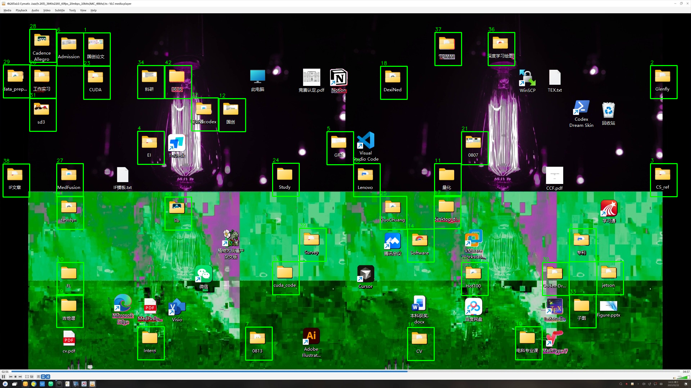
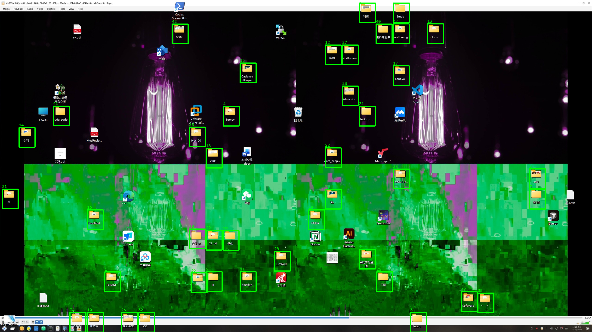
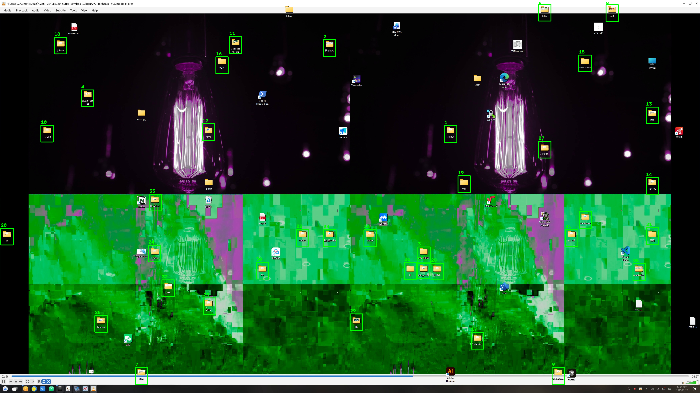

<h1 align="center">FolderSight</h1>

### Visual Folder Detection System

FolderSight is a visual folder detection system for Windows desktop screenshots. It fuses multiple visual cues to generate yellow folder candidates, segment likely folders, and localize final bounding boxes.

## Overview

FolderSight targets screenshots containing Windows yellow folder icons at 1080p, 2K, and 4K resolutions. The system combines edge-based shape matching, chamfer matching, HSV yellow candidate generation, SAM segmentation, shape/color filtering, and desktop wallpaper/grid refinement.

The repository is organized as a production pipeline only. Historical tuning runs, failed experiments, temporary analysis scripts, and large datasets are intentionally excluded.

## Pipeline

Input Screenshot -> Image Preprocessing -> DexiNed Edge Extraction -> MatchShape / Chamfer / Yellow HSV Candidate Generation -> Candidate Fusion -> SAM Segmentation -> Shape & Color Post-filter -> CV Post-processing -> Wallpaper/Grid Refinement -> Final Folder Bounding Boxes

## Installation

Create an environment and install PyTorch for your CUDA version first. For example, follow the selector at https://pytorch.org/get-started/locally/.

```bash
python -m venv .venv
source .venv/bin/activate
pip install --upgrade pip
pip install -r requirements.txt
```

If you use CUDA, install the matching PyTorch wheel before or after `requirements.txt` according to the official PyTorch command for your driver/CUDA stack.

## Model Weights

Model weights and third-party model checkouts are not included in this repository.

| Model | Purpose | Expected local path | Download URL |
| --- | --- | --- | --- |
| DexiNed | Edge extraction | `models/dexined/model.py` and `models/dexined/10_model.pth` | Source project: https://github.com/xavysp/DexiNed. Checkpoint URL TODO. |
| SAM ViT-Base | Prompted segmentation | `models/sam/` | https://huggingface.co/facebook/sam-vit-base |

The configs expect these paths:

```text
models/dexined/
  model.py
  10_model.pth
models/sam/
  config.json
  preprocessor_config.json
  model.safetensors
```

The production DexiNed checkpoint used during local validation is:

```text
filename: 10_model.pth
size: 141,069,187 bytes
sha256: bd4c603ef71113b447bffb72a73b9a54ca890e78f4bc8f34cb73f1efb2681e74
```

Use a checkpoint compatible with the current DexiNed architecture from the official project. TODO for one-click reproducibility: upload the validated `10_model.pth` checkpoint to a public model repository and add the download URL here.

For SAM, download the Hugging Face model directory locally, including `config.json`, `preprocessor_config.json`, and `model.safetensors`. The local validation weights used:

```text
filename: model.safetensors
size: 374,979,480 bytes
sha256: 892c410e496344e527255ccdcb2cb7244a609acb5389c7c4fdba1288f861c579
source: https://huggingface.co/facebook/sam-vit-base
```

## Quick Start

Run one 1080p demo image:

```bash
python pipelines/shape_prior_sam_test.py --image examples/1080p/1.jpg --output-dir outputs/demo_1080p/1 --config configs/pipeline_1080p.json --resolution 1080p --wallpaper-bg bg/bg_1080P.png
```

Run one 2K demo image:

```bash
python pipelines/shape_prior_sam_test.py --image examples/2k/1.jpg --output-dir outputs/demo_2k/1 --config configs/pipeline_2k.json --resolution 2k --wallpaper-bg bg/bg_2K.png
```

Run one 4K demo image:

```bash
python pipelines/shape_prior_sam_test.py --image examples/4k/1.jpg --output-dir outputs/demo_4k/1 --config configs/pipeline_4k.json --resolution 4k --wallpaper-bg bg/bg_4K.png
```

Run all bundled demo images:

```bash
python pipelines/run_dataset.py --input-root examples --output-root outputs/demo_batch --resolutions 1080p 2k 4k
```

Evaluate demo outputs against bundled GT:

```bash
python pipelines/evaluate_dataset.py --input-root examples --pred-root outputs/demo_batch --output-dir outputs/demo_eval --resolutions 1080p 2k 4k --match-iou 0.3 --pred-file final_refined_boxes.json
```

## Input / Output

Input is a desktop screenshot image. The included examples are:

```text
examples/1080p/{1,10}.jpg
examples/2k/{1,10}.jpg
examples/4k/{1,10}.jpg
```

Primary outputs:

| File | Meaning |
| --- | --- |
| `final_refined_boxes.json` | Final folder bounding boxes after post-processing and wallpaper/grid refinement. |
| `final_refined_boxes.png` | Visualization of the final folder boxes over the input screenshot. |

Additional intermediate outputs are written for inspection, including candidate visualizations, SAM masks, post-filter results, and refinement reports.

## Example Results

1080p:



2K:



4K:



## Evaluation

FolderSight reports object detection metrics at IoU = 0.3:

| Resolution | Images | Precision | Recall | F1 |
| --- | ---: | ---: | ---: | ---: |
| 1080p | 88 | 0.9195 | 0.8478 | 0.8822 |
| 2K | 88 | 0.8806 | 0.7931 | 0.8345 |
| 4K | 88 | 0.8010 | 0.8589 | 0.8289 |

The bundled evaluator computes precision, recall, F1, AP, PR AUC, and per-image metrics from `examples/*/gt/*.json` and prediction JSON files.

## Limitations

- FolderSight currently targets Windows yellow folder icons.
- Candidate generation remains one of the main recall bottlenecks.
- Similar yellow icons or yellow background regions can produce false positives.
- The heuristic shape/color score has limited discrimination for hard negatives.

## Acknowledgements

FolderSight builds on:

- DexiNed: Dense Extreme Inception Network for Edge Detection, MIT licensed source code. Project: https://github.com/xavysp/DexiNed
- Segment Anything Model (SAM), Apache-2.0 licensed model/code from Meta AI. Hugging Face model: https://huggingface.co/facebook/sam-vit-base
- PyTorch, Transformers, OpenCV, NumPy, Pillow, and Matplotlib.

Please follow the licenses and citation requirements of third-party models and libraries when redistributing or publishing derived work.
